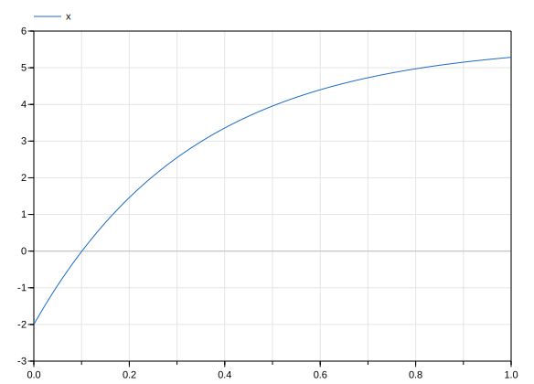
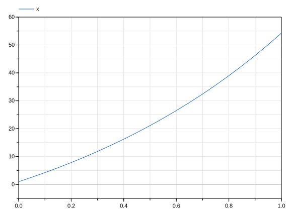
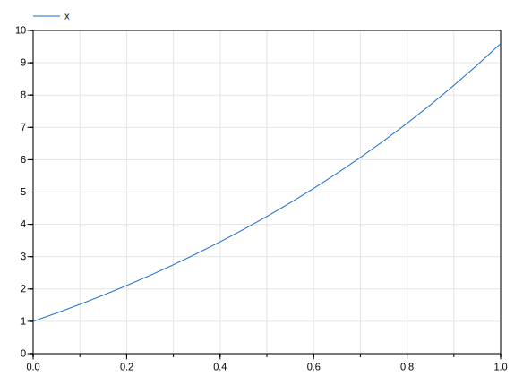
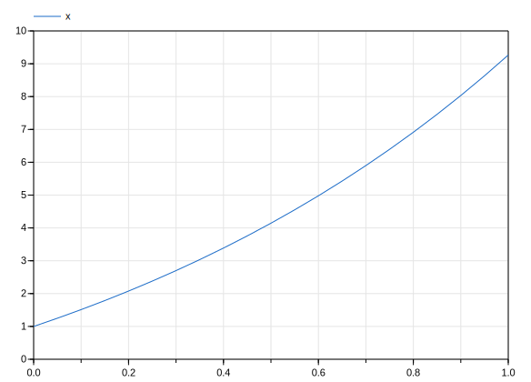

# Tasks
## Task 1
### 1.a

model: 
> wrapper for a model, should contain variables, constants and equations 

equation: 
> equation part of model, all lines between equation and end should be equations describing the model.

end: 
> end keyword of a model

parameter:
> variable constant, can be assigned new values post-compilation

Real: 
> a real number type, signed

start: 
> initial value of a variable

der: 
>first order time derivative of a variable

### 1.b

> They are comments, they increase readability, and explain any funky stuff going on.

### 1.c

### 1.d

> It locks the value, you can no longer set this value post-compilation in order to quickly simulate different variants. Same result as long as you let the values remain the same.

### 1.e
+ switched integrator to lsodar, 
+ reduced number of steps from 500 to 20.
+ switched a from -3 to 1
+ switched b from 17 to 30
+ switched x(0) from -2 to 1

### 1.f

simulations completed with:
+ a = 1
+ b = 4
+ x(0) = 1
+ simluation time: [0,1] s
+ simulation steps = 20
+ solvers: dassl and euler, respectively

